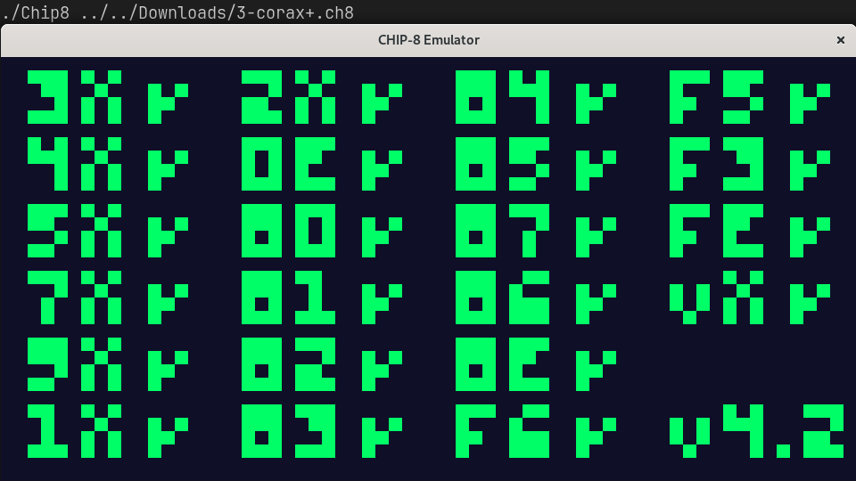

# CHIP-8 Emulator in C++

This project is a [Chip-8](https://en.wikipedia.org/wiki/CHIP-8) emulator/interpreter implemented in C++ using the SDL2 library. 

---

## Features

- **ROM loading from command line**: chip-8 programs, with the appropriate max. size, can be loaded from the command line.
- **Fetch-Decode-Execute:** as of march 17, 2025, 29/35 opcodes are implemented.
  <details>
    <summary>See list of implemented CHIP-8 instructions</summary>

    - `00E0` **CLS**: Clears screen.
    - `00EE` **RET**: Return from subroutine.
    - `1NNN` **JP *addr***: Jump to address.
    - `2NNN` **CALL *addr***: Call a subroutine at NNN.
    - `3XNN` **SE Vx, byte**: Skip next instruction if Vx is equal to byte.
    - `4XNN` **SNE Vx, byte**: Skip next instruction if Vx is not equal to byte.
    - `5XY0` **SE Vx, Vy**: Skip next instruction if Vx is equal to Vy.
    - `6XNN` **LD Vx *byte***: Loads register Vx with NN.
    - `7XNN` **ADD Vx, *byte***: Add NN to register Vx.
    - `8XY0` **LD Vx, Vy**: Loads Vx as Vy.
    - `8XY1` **OR Vx, Vy**: Loads Vx as Vx OR Vy (bitwise).
    - `8XY2` **AND Vx, Vy**: Loads Vx as Vx AND Vy (bitwise).
    - `8XY3` **XOR Vx, Vy**: Loads Vx as Vx XOR Vy (bitwise).
    - `8XY4` **ADD Vx, Vy**: Adds Vy to Vx and sets VF as 1 if overflow.
    - `8XY5` **SUB Vx, Vy**: Subtracts Vy from Vx and sets VF as not borrow.
    - `8XY6` **SHR Vx {, Vy}**: Shifts Vx 1 bit right and sets VF as previous Vx least significant bit.
    - `8XY7` **SUBN Vx, Vy**: Sets Vx as Vy - Vx and VF as not borrow.
    - `8XYE` **SHL Vx {, Vy}**: Shifts Vx 1 bit left and sets VF as previous Vx most significant bit.
    - `9XY0` **SNE Vx, Vy**: Skips instruction if Vx is not equal to Vy.
    - `ANNN` **LD I**: Loads Index register with NNN.
    - `BNNN` **JP V0, *addr***: Jumps to V0 + NNN.
    - `CXNN` **RND Vx, *byte***: Generates a random number between 0 and 255, does bitwise AND with *byte* and stores
       the result in Vx.
    - `DXYN` **DRW Vx, Vy, N**: Draws a N height sprite located at the memory
       position pointed by I register, in position (Vx, Vy).
    - `EX9E` **SKP Vx**: Skips next instruction if key with value of Vx is pressed.
    - `EXA1` **SKNP Vx**: Skips next instruction if key with value of Vx is not pressed.
    - `FX1E` **ADD I, Vx**: Values of I and Vx are added and stored in I.
    - `FX33` **ADD I, Vx**: Stores the BCD value of Vx in memory, starting from location I. 
    - `FX55` **LD Vx, \[I]**: reads X + 1 values from registers V0 to VX, into memory starting at location I.
    - `FX65` **LD Vx, \[I]**: reads X + 1 values from memory, starting at location I into registers V0 through Vx.

  </details>

- **Rendering with SDL2**: the Chip-8's 64x32 screen is implemented by a 960x480 SDL window.

---

## Requirements

- g++ (or any c++ compiler, although modifications to the Makefile will be necessary)
- SDL2 library for graphics
- Makefile for compilation script
- Catch.hpp to run tests

---

## Setup and installation

### [1. Install SDL2 (if not installed)](https://wiki.libsdl.org/SDL2/Installation)

### 2. Clone repository

```shell
git clone https://github.com/guilhermelirar/Chip-8.git
cd Chip-8
```

### 3. Compile program
Use the Makefile provided to compile the program:

```shell
make
```

---

## Usage
To load a Chip-8 program on the emulator, you need to pass the file path as an argument when running from the command line, for example:

```shell
./Chip8 1-chip8-logo.ch8
```

`.ch8` extension is not enforced by this emulator. The emulator will reject a file with size that does not fit in Chip-8 area of memory dedicated to programs,
that is, Chip-8 has a memory of 4 KB, but ROMs are loaded at position 0x200, so a ROM must be at most 3585 bytes.

---

## Tests

This project has automated tests with `catch.hpp`. Tests can be run with the Makefile provided:
```shell
make test
```

---

## Screenshots
<p align="center">
  
  
  
  
</p>

---

## Inspiration and more information about Chip-8

This is an ongoing personal project for the purpose of fun and learning about emulators. 
I got this idea because I initially thought of an NES emulator, but decided to start with a smaller but still fun project, Chip-8.

In this project, the [Cowgod's Chip-8 Technical Reference](http://devernay.free.fr/hacks/chip8/C8TECH10.HTM#dispcoords) is being a good guide.

---

## License
This project is licensed under the MIT License - see the [LICENSE](LICENSE) file for details
